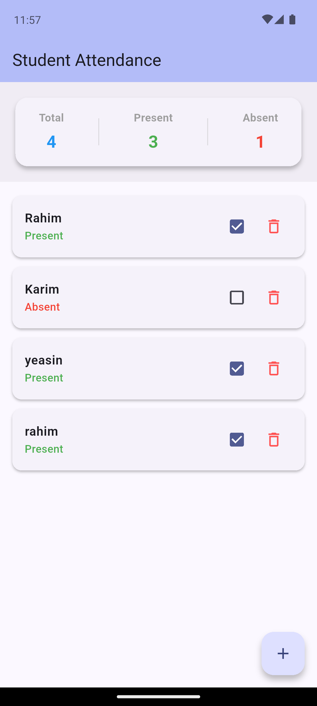
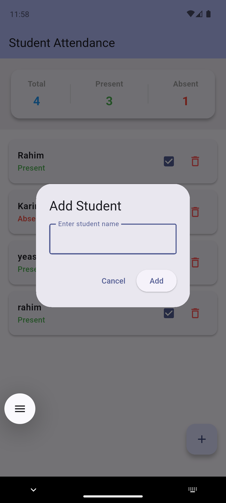

# Student Attendance Tracker 📱🎓

A clean, high-performance Flutter application built for the **Flutter Provider State Management Live Test**. This app manages student attendance records reactively using the **Provider** package with strict adherence to separation of concerns and modern Material 3 design guidelines.

---

## 📸 App Previews

| Main Dashboard & Statistics | Add Student Dialog | Empty State |
| :---: | :---: | :---: |
|  |  |  |

---

## 🚀 Key Features

- **Reactive State Management**: Powered entirely by `ChangeNotifier` and `Provider` (No `setState()`, GetX, BLoC, or Riverpod for business logic).
- **Real-Time Statistics**: Automatically computes Total Students, Present count, and Absent count directly from the student dataset.
- **Interactive Attendance Tracking**: Toggle student presence instantly using checkboxes, reflecting changes across UI and statistics simultaneously.
- **Student Management**: Add new students with validation (preventing empty names) and delete students with one tap.
- **Empty State UI**: Displays a clean, intuitive empty state when no students remain in the system.
- **Sample Initial Data**: Pre-loaded with sample students (Rahim, Karim, Nusrat) for instant testing and demonstration.

---

## 📁 Project Structure

```text
lib/
├── main.dart                  # Entry point & ChangeNotifierProvider setup
├── models/
│   └── student.dart           # Student data model (name, isPresent)
├── providers/
│   └── attendance_provider.dart # State management logic & business rules
└── screens/
    └── attendance_screen.dart # Single-screen UI (AppBar, Stats, List, FAB)
```

---

## 🛠️ State Management Rules & Architecture

- **`ChangeNotifierProvider`**: Wraps the root application to provide `AttendanceProvider` down the tree.
- **`context.read<AttendanceProvider>()`**: Used inside event handlers (FAB actions, checkboxes, delete buttons) to trigger state mutations without triggering widget rebuilds.
- **`context.watch<AttendanceProvider>()` & `Consumer`**: Used to listen to state changes and reactively rebuild UI components (such as the statistics header and student list view).
- **`notifyListeners()`**: Called inside `AttendanceProvider` methods (`addStudent`, `removeStudent`, `updateAttendance`) to notify all subscribers immediately upon state mutation.

---

## ⚙️ Getting Started

1. **Clone the repository**:
   ```bash
   git clone https://github.com/your-username/student_attendence_tracker_app.git
   ```
2. **Install dependencies**:
   ```bash
   flutter pub get
   ```
3. **Run the app**:
   ```bash
   flutter run
   ```

---

## 🧪 Running Tests

To execute widget tests:
```bash
flutter test
```
